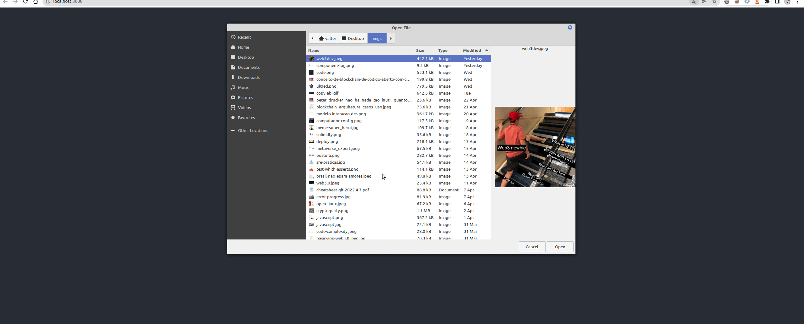

# Example UPLOAD FILE TO IPFS 

In the project directory, you can run:

### `npm start`

###  NODE CLIENT  : INFURA : https://ipfs.infura.io:5001/api/v0

### ver este exemplo : NFT de TEXTO : https://www.web3dev.com.br/pamelaaline/armazenamento-dapp-usando-solidity-e-ipfs-1p38
